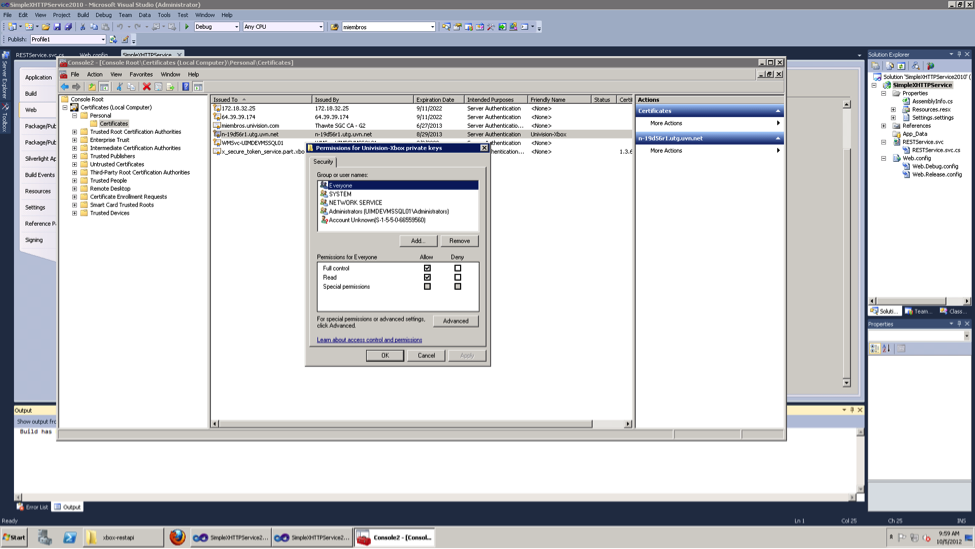
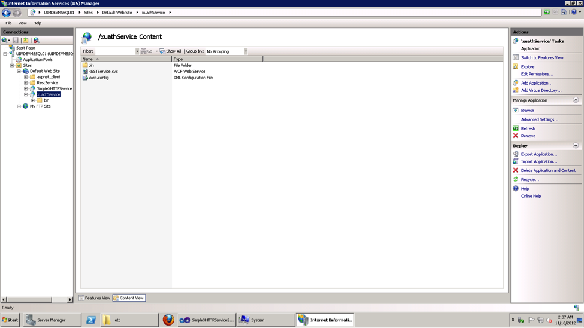

Steps for  Installing .net application
- Installation packages.
  + IIS server 7
  + .net framework  4.0
- The code package is available in
  + Use the back up one from the Production M3 servers
- Unzip the file and open xbox-restapi folder (the contants would be a bunch of dlls and webconfig)
- Create a Virutal directory called Xauth.univison.com in IIS
- Map it to the unzipped directory
- Restart the servers
- Add  the following certificates to mmc
  + xbox-token-FullCert.pfx – change  access  permissions to every one
  + xauth.univision.com.pfx - change  access  permissions to every one
  + x_secure_token_service.xboxlive.com.cer
  + x_secure_token_service.part.xboxlive.com.cer
  + x_token_service.xboxlive.com
    

- Add Microsoft.IdentityModel.dll to the bin folder of the app if it’s not available
  
